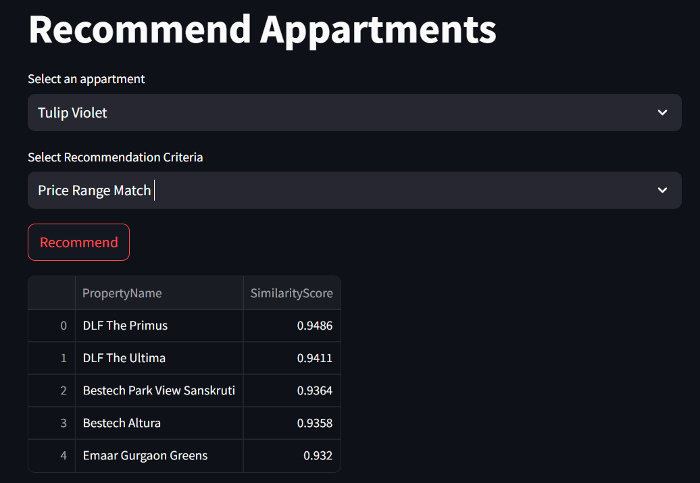
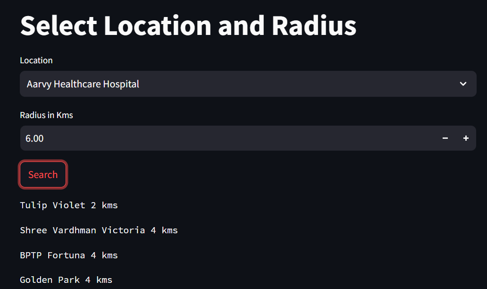

# Gurgaon Property Insights: Predict and Explore

## Introduction
This project leverages web scraping and machine learning techniques to predict property prices in Gurgaon, providing valuable insights for buyers and sellers in the real estate market.

  - **[Access the Interactive App Here](http://18.209.98.26:8501/)** *(click to open Streamlit Interface)*

## Key Features
- **Data Scraping:** Collected 3600 records from MagicBricks using Selenium and Beautiful Soup.
- **Data Analysis:** Conducted univariate and multivariate analysis, including outlier detection and missing value imputation and applied feature selection method.
- **Model Performance:** Achieved **R² = 0.905** and **MAE = 0.457** with Xgboost.
-  **Recommendation System**: Implemented a cosine similarity-based recommendation engine that suggests properties based on price details, nearest locations, and top facilities.
- **Interactive App:** Developed a Streamlit app hosted on AWS, predictive model for estimating house/flat prices, featuring property rate visualization and a recommendation engine. 


## Functionalities

**Data Analysis:**
- Price per sqft analysis done via Interactive Map  
  
- Pie chart analysis of the bedroom share per sector  
  

**Recommendation System:**
- Utilizes cosine similarity to provide tailored suggestions based on weighted criteria specified by the user.  
  

**Proximity-Based Searching:**
- Recommends nearby societies based on user-defined proximity distance.  
  

  
## Technologies Used
- Python, Pandas, NumPy, Selenium, Beautiful Soup, Streamlit, Plotly, AWS

<!-- ## Installation and Usage
To run the application locally, clone the repository and install the required packages:
```bash
git clone <repository-url>
cd <project-directory>
pip install -r requirements.txt
streamlit run app.py -->
